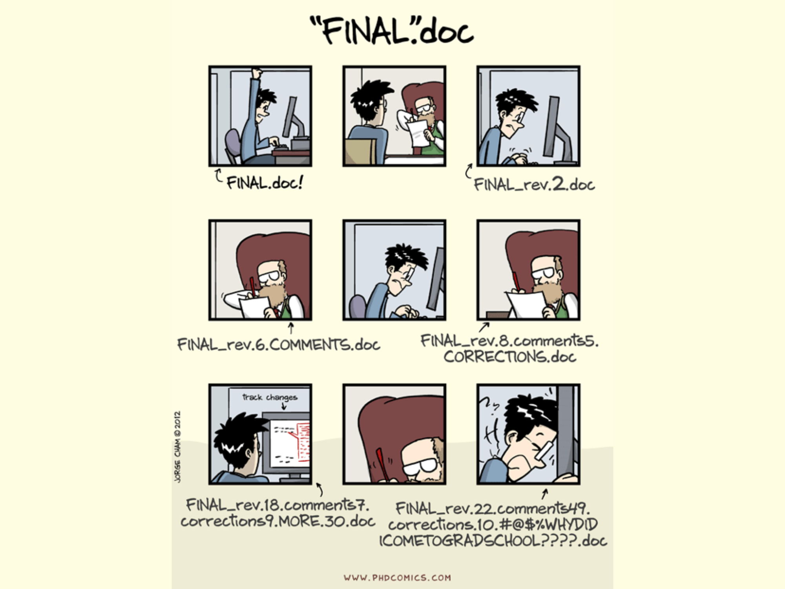
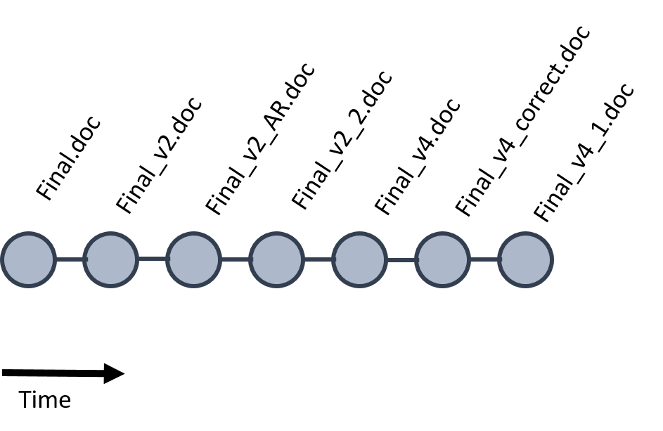
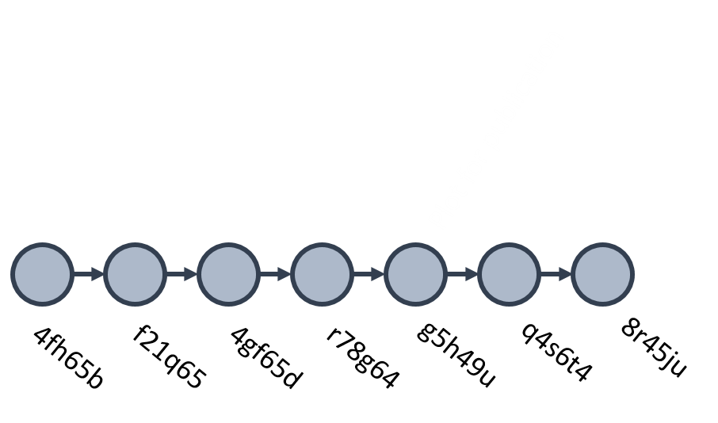
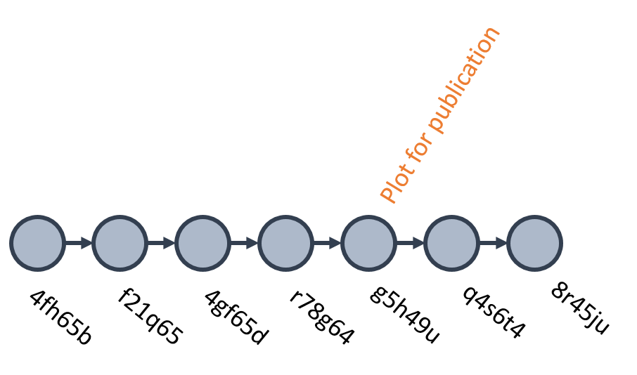
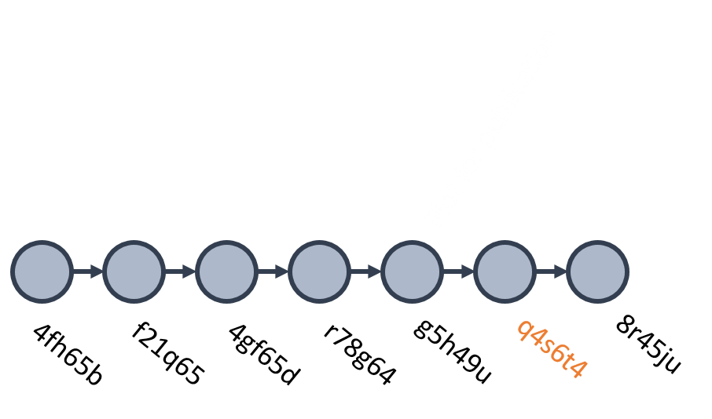
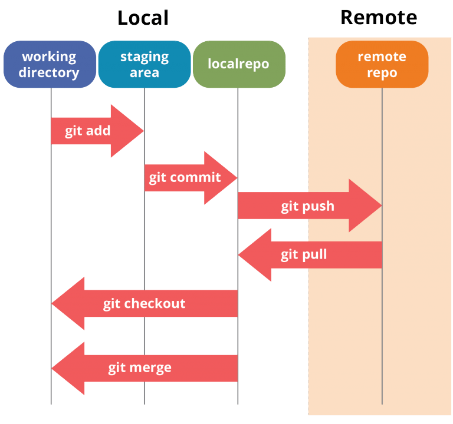

```{r setup, include=FALSE}
knitr::opts_chunk$set(echo = FALSE)
```


<style>
div.footnotes {
  position: absolute;
  bottom: 0;
  margin-bottom: 10px;
  width: 80%;
  font-size: 0.6em;
}
</style>

<script src="https://ajax.googleapis.com/ajax/libs/jquery/3.1.1/jquery.min.js"></script>
<script>
$(document).ready(function() {
  $('slide:not(.backdrop):not(.title-slide)').append('<div class=\"footnotes\">');

  $('footnote').each(function(index) {
    var text  = $(this).html();
    var fnNum = (index+1).toString();
    $(this).html(fnNum.sup());

    var footnote   = fnNum + '. ' + text + '<br/>';
    var oldContent = $(this).parents('slide').children('div.footnotes').html();
    var newContent = oldContent + footnote;
    $(this).parents('slide').children('div.footnotes').html(newContent);
  });
});
</script>

## What is version control

<center></center>

## What is version control

- If you are making copies of projects and renaming them so that you can make some modifications, you should be using version control.

- If you are taking somebody’s changes to their project and manually changing your slightly-different project to include the newest changes, you should be using version control.

- If you want to try something new (no matter how silly) with your code but don’t want to risk breaking your project, you should be using version control.

## Git

- Git is a distributed version control system. It was originally designed for Linux kernel developers in 2005.
- No server required, but in team projects a master repository is used on a server, we will be using GitHub.com, but there are others.
- If you want information about changes to the repository, or commit logs, it is all stored locally and no internet connection is required.

## GitHub

- This is where hosting services like GitHub, Bitbucket, and GitLab come in.
- They provide a home for your Git-based projects on the internet. If you have no idea what I’m talking about, think of it as DropBox but much, much better.
- It allows other people to see your stuff, sync up with you, and perhaps even make changes. These hosting providers improve upon traditional Unix Git servers with well-designed web-based interfaces.

##  History: a series of changes

<center></center>

<footnote>https://perso.liris.cnrs.fr/pierre-antoine.champin/enseignement/intro-git/</footnote>

## History: a series of changes
<center></center>

## History: a series of changes
- A unique identifier
- What changed ?
- When did it change ?
- Who changed it ?
- Why did it change ?

## History: a series of changes
- **A unique identifier**
- What changed ?
- **When did it change ?**
- Who changed it ?
- **Why did it change ?**


## Git flow
With git, each change is a commit with a unique identifier

<center></center>

The sha is a key into a database, which provide the author, date and a description

## Git flow
You can also name individual commits (tag)
<center></center>

```{r, eval=FALSE, echo = TRUE}
    git tag g5h49u Plot for publication
```

## Git flow
See exactly what's changed

<center></center>


```{r, eval=FALSE, echo = TRUE}
    git diff r78g64..g5h49u
```

## Git flow
Go back to a previous change with git checkout

<center></center>

```{r, eval=FALSE, echo = TRUE}
  git checkout q4s6t4
```


## Git architecture
<center></center>
<footnote><https://www.edureka.co/blog/git-tutorial/><footnote>

## Setup git
- Get a github account.
- Download and install git.

- Set up git with your user name and email. Open a terminal/shell and type:

```{r, eval=FALSE, echo = TRUE}
    git config --global user.name "Your name here"
    git config --global user.email "your_email@example.com"
```

More info about setting git on your computer:
<https://kbroman.org/github_tutorial/pages/first_time.html>

## Clone git project
```{r, eval=FALSE, echo = TRUE}
git clone git@github.com:JBLecomte/git-workshop.git
```


## Create a local Git repository
Go to your directory and open a shell
```{r, eval=FALSE, echo = TRUE}
git init
git add -A
git commit -a -m 'First commit'
git remote add origin git@github.com:JBLecomte/Introduction-git.git
git push -u origin master
```

## Keep track of your modifications

After you’ve made some small modifications to your project and checked that they work, use git add to indicate that they’re ready.
```{r, eval=FALSE, echo = TRUE}
git add R/modified.R man/modified.Rd
```

Then use git commit to add the modifications to the repository.
```{r, eval=FALSE, echo = TRUE}
git commit -m "Fix such and such"
```

## Keep track of your modifications and push

After you’ve made some small modifications to your project and checked that they work, use git add to indicate that they’re ready.
```{r, eval=FALSE, echo = TRUE}
git add R/modified.R man/modified.Rd
```

Then use git commit to add the modifications to the repository.
```{r, eval=FALSE, echo = TRUE}
git commit -m "Fix such and such"
git push
```

## .gitignore

- The various files in your project directory that you’re not tracking in git should be indicated in a .gitignore file.

- You don’t have to have a .gitignore file, but if you don’t, those files will show up every time you type git status.

- Each subdirectory can have its own .gitignore file, too.


## Amend the last commit message

“Oops! That last commit message was screwed up. How do I edit an incorrect commit message?”

This usually happens to me when I intended to use just git commit but typed git commit -a and committed a whole bunch more stuff that I hadn’t mentioned in the commit message.

It’s easy to fix just the message for the last commit:
```{r, eval=FALSE, echo = TRUE}
git commit --amend -m "New commit message"
```
Or leave off the -m "New commit message" and type the message in the text editor that opens.

## Undo a commit and redo (before pushing)

```{r, eval=FALSE, echo = TRUE}
git add make_plot.R  
git commit -m "Something terribly misguided"             # (1)
git reset HEAD~                                          # (2)
<< edit make_plot.R file as necessary >>                 # (3)
git add make_plot.R                                      # (4)
git commit -c ORIG_HEAD                                  # (5)
```

## Branch

<center></center>

## Branch

<center></center>


## Branching and merging (1)

To create a branch called new_feature:

```{r, eval=FALSE, echo = TRUE}
git branch new_feature
```
Then “check it out”:

```{r, eval=FALSE, echo = TRUE}
git checkout new_feature
```
Make various modifications, and then add and commit.

To go back to the master branch, check it out:
```{r, eval=FALSE, echo = TRUE}
git checkout master
```

## Branching and merging (2)
To push the branch to github, use this:
```{r, eval=FALSE, echo = TRUE}
git push origin new_feature
```
If you make changes to the master branch, you’ll want to merge them into your exploratory one:
```{r, eval=FALSE, echo = TRUE}
git checkout new_feature
git merge master
```
If you’re satisfied with your changes in the exploratory branch, merge them into the master:
```{r, eval=FALSE, echo = TRUE}
git checkout master
git merge new_feature
```

## Branching and merging (3)
If you’re done with the branch and want to delete it:
```{r, eval=FALSE, echo = TRUE}
git branch -d new_feature
```
But if you pushed it to github, it will still exist there. This is how to delete the branch from github:
```{r, eval=FALSE, echo = TRUE}
git push origin --delete new_feature
```

## Branching and merging (4)
After pulling from github, use the following to get access to a branch that is only on github:
```{r, eval=FALSE, echo = TRUE}
git checkout -b new_feature origin/new_feature
```
If you want to pull a particular branch from a collaborator’s repository, do this:
```{r, eval=FALSE, echo = TRUE}
git checkout new_feature
git pull myfriend new_feature
```

## Stash (1)

- If your working directory is in a state where you don’t want to commit yet, but you would like to change branches, GIT won’t let you. You need to stash your changes.

```{r, eval=FALSE, echo = TRUE}
git stash
```

- Your changes are stashed for retrieval later. Now you can switch branches.
```{r, eval=FALSE, echo = TRUE}
git status
```

## Stash (2)
Will show you that there is now nothing to commit. It will still show you untracked files, because they are still there.
```{r, eval=FALSE, echo = TRUE}
git stash list
```

Shows you all the stashes you have stored. Go away and do some other work, and then when you are ready, you can bring back your changes by changing to the branch where you stashed something and typing:
```{r, eval=FALSE, echo = TRUE}
git stash apply
```

## Contribute to someone repo

<http://kbroman.org/github_tutorial/pages/fork.html>

## Handling merge conflicts 

When you and your friend make changes to the same file at the same time
```{r, eval=FALSE, echo = TRUE}
git pull myfriend master
```

You’ll get a message like
```{r, eval=FALSE, echo = TRUE}
Auto-merging README.md
CONFLICT (content): Merge conflict in README.md
Automatic merge failed; fix conflicts and then commit the result.
```

## online ressource
- Gui <https://www.gitkraken.com/>
- Rstudio and Github course : <https://rstudio.com/resources/webinars/rstudio-essentials-webinar-series-managing-part-2/>
- Online free book for using R and Git <https://happygitwithr.com/>
- Nice tutorial for the basics <http://kbroman.org/github_tutorial/>
